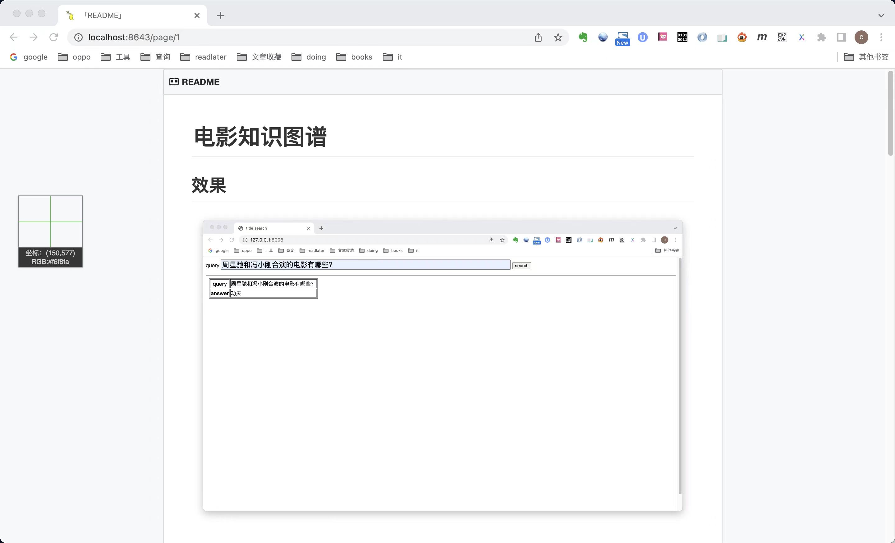

# task3

> 选做题：4选一

## 本节作业（选做题1）

> 欢迎提交你使用GPT进行学习的例子（任何学习活动皆可），我们将评选好用的“GPT学习助手”，本次学习结束后更新到案例库中。

## 本节作业（选做题2）
> 欢迎提交你使用GPT帮助你编程实践的例子（数据分析、数据挖掘、代码编程等皆可），我们将评选好用的“GPT编程实践”，本次学习结束后更新到案例库中。
## 本节作业（选做题3）
> 欢迎提交你使用GPT辅助你做科研相关的例子，我们将评选好用的“GPT科研辅助”，本次学习结束后更新到案例库中。
## 本节作业（选做题4）
> 欢迎任选场景，提交你使用GPT找到的有趣的玩法，我们将评选好用的“GPT有趣玩法”，本次学习结束后更新到案例库中。

# 回答（选做题4）：

基于chatpgt进行query分析构建自有知识体系的问答系统。

对于问答系统比较麻烦的问题就是需要分析query，识别出query里的实体和关系。使用chatgpt可以很容易的完成这个工作。

1. 使用neo4j构造一个电影的知识图谱。


2. 使用chatgpt用来分析实体和关系。并构造出neo4j的查询语句。比如：
> **prompt：**
>
> **对下面的语句做实体和关系的分析，生成neo4j的查询语句：周星驰和冯小刚合演的电影有哪些？**

**chatgpt：**
```
实体： 
1. 周星驰 （Person） 
2. 冯小刚（Person） 
3. 电影（Movie） 

关系： 1. 合演（Acted_In） 

查询语句： 
MATCH (周星驰:Person)-[:Acted_In]->(电影:Movie)<-[:Acted_In]-(冯小刚:Person)  WHERE 周星驰.name = '周星驰' AND 冯小刚.name = '冯小刚'   RETURN DISTINCT 电影.title AS 合演电影列表
```

3.执行查询语句。去得结果返回：

